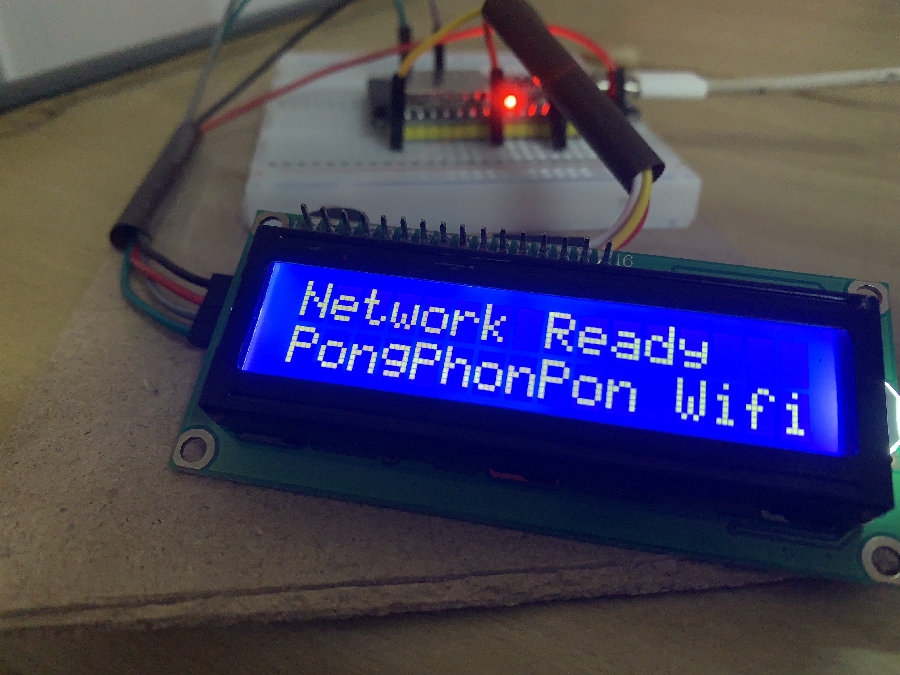
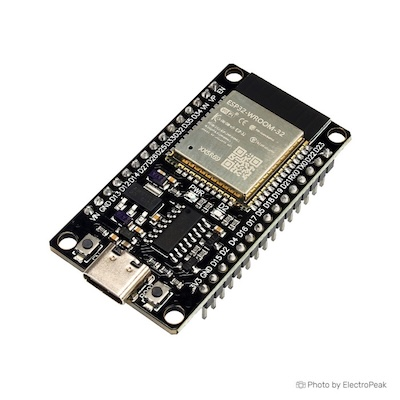
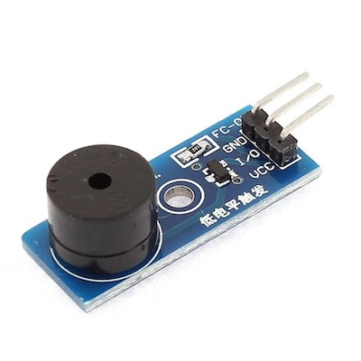
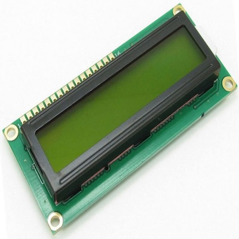
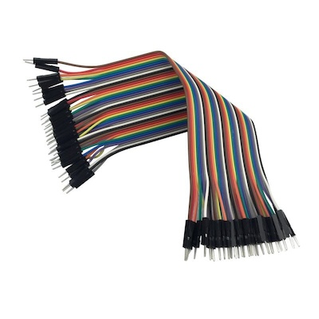
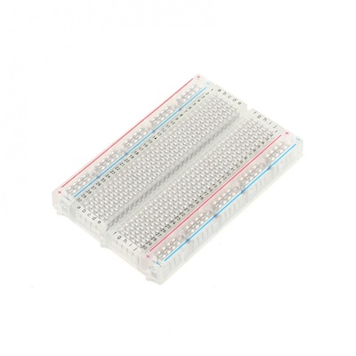

# Physical Computing Project 2025 - IT KMITL

## จุดประสงค์ของ project
โครงงานนี้มีวัตถุประสงค์เพื่อพัฒนา ระบบ Captive Portal สำหรับการยืนยันตัวตนผ่าน LINE  
บนบอร์ด ESP32 โดยให้ ESP32 ทำหน้าที่เป็น เราเตอร์ขนาดเล็ก (NAT Router) ที่สามารถปล่อยสัญญาณ  
Wi-Fi ให้ผู้ใช้งานเชื่อมต่อ และบังคับให้เข้าสู่หน้าเข้าสู่ระบบ (Login Page) ก่อนใช้งานอินเทอร์เน็ตได้จริง ระบบ 
ถูกออกแบบให้มีการ เชื่อมต่อกับแพลตฟอร์ม LINE เพื่อใช้เป็นช่องทางในการยืนยันตัวตนของผู้ใช้ โดยเมื่อผู้ใช้ 
ทำการ Login ผ่าน LINE สำเร็จ ข้อมูลผู้ใช้ เช่น userId และ displayName จะถูกส่งกลับมายัง ESP32  
ผ่าน MQTT Broker เพื่อให้ ESP32 เปิดการใช้งานอินเทอร์เน็ตแบบถาวร พร้อมทั้งแสดงชื่อผู้ใช้บนจอ LCD และส่งเสียงแจ้งเตือนผ่าน Buzzer 

การดำเนินงานเริ่มจากการนำโปรเจกต์ต้นฉบับ esp32_nat_router มาปรับปรุง โดยเพิ่มฟังก์ชันสำคัญ ได้แก่ DNS Hijack, Captive Portal Server, Temporary NAT Control, และ User Event Handler เพื่อควบคุมการทำงานของ LCD, Buzzer และ MQTT เมื่อมีการ Login สำเร็จ ESP32 จะทำหน้าที่เป็นทั้ง SoftAP, NAT Router, DNS Server และ HTTP Server ที่แสดงหน้าเว็บ Captive Portal สำหรับ Login ด้วย LINE LIFF นอกจากนี้ ยังมีการพัฒนา Backend บน Node.js เพื่อเชื่อมต่อกับ LINE Developer Platform ทำหน้าที่รับ Callback จาก LINE, ขอ Access Token, ดึงข้อมูลผู้ใช้ และส่งข้อมูลกลับมายัง ESP32 ผ่าน MQTT 

ผลการทดลองพบว่า ESP32 สามารถปล่อยสัญญาณ Wi-Fi ในชื่อ “Pongphonpon Wi-Fi” ให้ผู้ใช้เชื่อมต่อและเข้าถึงอินเทอร์เน็ตได้หลังจาก Login สำเร็จ ระบบสามารถแสดงชื่อผู้ใช้บน LCD และแจ้งเตือน 
ด้วยเสียง Buzzer ได้ถูกต้อง อีกทั้งยังสามารถเพิ่มเพื่อน LINE OA ของร้านได้อัตโนมัติ ซึ่งช่วยยกระดับการใช้งาน Wi-Fi ฟรีให้กลายเป็นช่องทางการตลาดที่มีฐานข้อมูลลูกค้าจริง 

ประโยชน์ของโครงงานนี้คือสามารถนำไปใช้ในร้านค้า ร้านกาแฟ หรือพื้นที่บริการสาธารณะ เพื่อควบคุมการเข้าใช้งาน Wi-Fi พร้อมเก็บข้อมูลลูกค้าและส่งโปรโมชั่นผ่าน LINE OA ได้โดยอัตโนมัติ อีกทั้งยังเป็นการต่อยอดขีดความสามารถของ ESP32 ให้เป็น Gateway อัจฉริยะ (Smart IoT Gateway) ที่รวม NAT, DNS, HTTP, MQTT, LCD และระบบแจ้งเตือนไว้ในอุปกรณ์เดียว ช่วยลดต้นทุนและเพิ่มความสะดวกในการติดตั้งใช้งานจริง

---

## รายละเอียด project 

### จุดเด่นของโปรเจกต์
การดำเนินงานเริ่มจากการนำโปรเจกต์ต้นฉบับ esp32_nat_router มาปรับปรุง โดยเพิ่มฟังก์ชันสำคัญ ได้แก่ DNS Hijack, Captive Portal Server, Temporary NAT Control, และ User Event Handler เพื่อควบคุมการทำงานของ LCD, Buzzer และ MQTT เมื่อมีการ Login สำเร็จ ESP32 จะทำหน้าที่เป็นทั้ง SoftAP, NAT Router, DNS Server และ HTTP Server ที่แสดงหน้าเว็บ Captive Portal สำหรับ Login ด้วย LINE LIFF นอกจากนี้ ยังมีการพัฒนา Backend บน Node.js เพื่อเชื่อมต่อกับ LINE Developer Platform ทำหน้าที่รับ Callback จาก LINE, ขอ Access Token, ดึงข้อมูลผู้ใช้ และส่งข้อมูลกลับมายัง ESP32 ผ่าน MQTT
### อุปกรณ์ที่ใช้
| ESP32 CH340 | Buzzer | LCD | Jumper Wire | Breadboard
|---|---|---|---|---|
|  |  |  |  |  |

### Tool/Library
- ESP-IDF (Espressif IoT Development Framework) v4.4.6
- xtensa-esp32-elf toolchain
- esp_wifi.h, esp_netif.h, esp_event.h – for Wifi
- lwip_napt.h, ip_addr.h – for NAT
- sockets.h, dns_hijack – for DNS
- dhcpserver.h, dhcpserver_options.h – for DHCP
- esp_http_server.h – for HTTP
- I2C Driver
- MQTT Client
- FreeRTOS
- NVS (Non-Volatile Storage)
- Ngrok
- Line platform
### ขั้นตอนการทำงาน
1. เริ่มต้นการทำงาน ESP32 เชื่อมต่อกับ STA และเริ่มทำงานเป็น access point หน้าจอ LCD แสดงข้อความ “Router starting…” buzzer ส่งเสียงดัง ปิ๊บๆ
2. เปิด NAT และ DNS hijack หน้าจอ LCD แสดงข้อความ “Network Ready” , “PongPhonpon Wifi” buzzer ส่งเสียงดัง ปิ๊บๆ
3. Captive portal server เริ่มการทำงาน
4. ผู้ใช้เชื่อมต่อ Wifi DNS ตอบทุก domain ชี้ไปที่ 192.168.4.1
5. แสดงหน้า login ใน captive portal
6. ESP32 เปิด NAT ชั่วคราว 3 นาที เพื่อให้ผู้ใช้ออกเน็ตได้
7. ผู้ใช้กด Login Line และถูก redirect ไปที่ browser จริงก่อนระบบจะเปิดแอพ line ขึ้นมาให้ผู้ใช้ login
8. ผู้ใช้กดปุ่ม login line และเพิ่มเพื่อน LINE OA ของร้าน จากนั้นระบบแสดงหน้า chat ของ LINE OA
9. Backend ส่งข้อมูลผู้ใช้ขึ้นไปที่ MQTT broker
10. ESP32 รับ MQTT message แล้วตรวจสอบข้อมูลผู้ใช้
11. LCD แสดงข้อความ “username”, “Friend added!” และ buzzer ส่งเสียง ปิ๊บๆ
12. ESP32 เปิด NAT ถาวรให้ผู้ใช้และจบการทำงาน
### ปัญหาและวิธีการแก้ไข
1. ใน project ต้นฉบับเมื่อ ESP32 ถูกเชื่อมต่อ NAT จะถูกเปิดขึ้นทันที แต่ยังไม่มีฟังก์ชัน DNS hijack เมื่อโทรศัพท์ขอ connectivitycheck.gstatic.com ESP32 จะไม่รู้จัก domain ทำให้ไม่มีการตอบสถานะใดๆกลับมา โทรศัพท์จึงคิดว่าไม่มีอินเทอร์เน็ต แต่ก็ไม่เด้งหน้า captive portal ขึ้นมาให้ การแก้ปัญหา : ทำการเพิ่มฟังก์ชัน DNS hijack ให้ตอบ DNS ทุก domain ให้ช้ำที่ local host ของ ESP32 ก็คือ 192.168.4.1 และเพิ่ม HTTP server ที่จะตอบ HTML ธรรมดาแทน 204 เพื่อให้ captive portal สามารถแสดงขึ้นมาได้
การแสดงหน้า portal เมื่อผู้ใช้เชื่อมต่อ Wifi จะเป็นหน้า local host ของ ESP32 ทำให้ขณะนั้นผู้ใช้ไม่มีอินเทอร์เน็ต แต่การ login ด้วย line จะต้องมีการ redirect ไปที่ LINE ซึ่งผู้ใช้จะต้องมีความสามารถในการใช้งานอินเทอร์เน็ตได้ในขณะนั้น ทำให้ระบบเกิด Deadlock ESP32 ไม่ได้รับข้อมูลเพราะผู้ใช้ยังไม่ได้ login และผู้ใช้ก็ยังไม่สามารถ login ได้ เพราะยังไม่มีอินเทอร์เน็ต การแก้ปัญหา : เพิ่มการทำงานให้ ESP32 ที่ทำหน้าที่เป็น access point เปิดใช้งาน NAT ชั่วคราวเป็นเวลา 3 นาที เมื่อมีผู้ใช้เชื่อมต่อเข้ามาและกด login ในหน้า captive portal เพื่อให้ผู้ใช้สามารถใช้งานอินเทอร์เน็ตในการ redirect ไปที่ LINE แล้วทำการ login และส่งข้อมูลกลับมาที่ ESP32 เพื่อให้สามารถใช้งานอินเทอร์เน็ตได้ถาวร หากผู้ใช้ไม่ login ภายในเวลาที่กำหนด NAT จะถูกปิดทำให้เครื่องของผู้ใช้ไม่สามารถใช้งานอินเทอร์เน็ตได้
ปัญหาการสื่อสารกันระหว่าง ESP32 กับ Backend Line callback คือ เมื่อผู้ใช้ทำการ login สำเร็จจะต้องมีการส่งข้อมูลจาก backend กลับมาบอกที่ ESP32 ว่าการ login สำเร็จแล้วเพื่อให้ ESP32 เปิด NAT ให้ผู้ใช้สามารถใช้งานได้ถาวร แต่ backend ซึ่งอยู่ใน public ip กับ ESP32 ที่อยู๋ใน 132.168.4.1 ซึ่งเป็น local host ของตัวเองมันไม่สามารถติดต่อสื่อสารกันได้ ทำให้การ login จะถือว่าไม่สำเร็จ การแก้ปัญหา : ใช้ protocol MQTT แทนการติดต่อกันโดยตรง โดยสร้าง topic ขึ้นมาสำหรับใช้ public ข้อมูลขึ้นไปเมื่อผู้ใช้ login สำเร็จ และให้ ESP32 คอย subscribe topic นั้นไว้เมื่อมี mac address ของเครื่องที่ขอเชื่อมต่อในตอนแรกกลับมาพร้อมกับข้อมูล line ESP32 ก็จะรู้ได้ว่าการ login นั้นสำเร็จแล้ว และจะทำการเปิดอินเทอร์เน็ตให้ใช้งานต่อไปได้
2. ปัญหาของฝั่ง backend เมื่อ ESP32 ส่งค่าหลังจากที่ผู้ใช้ทำการ log in สำเร็จแล้ว แต่ backend ไม่สามารถรับค่านั้นมาประมวลผลเพื่อนำไปทำงานในขั้นตอนถัดไปได้ เนื่องมาจากการตั้งค่ารูปแบบของข้อมูลของทั้งฝั่งสองไม่ตรงกัน ในฝั่ง ESP32 ส่งแอททริบิวต์ name แต่ backend รับเป็นรูปแบบแอททริบิวต์ username ซึ่งทำให้รูปแบบของข้อมูลไม่ตรงกัน ฝั่ง backend จึงไม่สามารถรับข้อมูลได้ การแก้ปัญหา : ตั้งค่ารูปแบบของข้อมูลให้สอดคล้องกัน โดยผู้พัฒนาฝั่ง backend ต้องตรวจสอบการตั้งค่ารูปแบบข้อมูลที่จะส่งภายในโค้ดของฝั่ง ESP32

---

## Resources
#### Website github.io
[github.io](https://bureerak.github.io/3P/)

#### Demo Video
[youtube - 3P : PongPhonPon Wifi by ESP32](https://youtu.be/FyEzlFBqOGs?si=VcWGbEDgWDnDO8vB)

#### Poster
 

---

## สมาชิกในกลุ่ม
<table>
  <tr>
    <th>รหัสนักศึกษา</th>
    <th>ชื่อจริง นามสกุล</th>
    <th>หน้าที่</th>
  </tr>

  <tr>
    <td>67070100</td>
    <td>นายปองพล บุรีรักษ์</td>
    <td>
      <li>ออกแบบหน้าเว็บฝั่ง Frontend</li>
      <li>สร้างลอจิกหน้าบ้านเพื่อรับส่งข้อมู,มาแสดงผลและส่งออก</li>
    </td>
  </tr>

  <tr>
    <td>67070118</td>
    <td>นายพิภพ ทองอั้น</td>
    <td>
      <li>ออกแบบและต่อวงจร (ESP32, LCD, Buzzer)</li>
      <li>เขียนระบบการทำงานของ ESP32 และLine Callback Backend</li>
    </td>
  </tr>

  <tr>
    <td>67070145</td>
    <td>นายยศพนธ์ มโนวรกุล</td>
    <td>
      <li>พัฒนา Backend สำหรับติดต่อจาก Frontend และส่งรายละเอียดต่าง ๆ ไปที่แอปพลิเคชัน Line</li>
    </td>
  </tr>

  <tr>
    <td>67070166</td>
    <td>นายวิรยบวร บุญเปรี่ยม</td>
    <td>
      <li>พัฒนา Backend รับข้อมูลจากวงจร ESP32 สำหรับจัดการและเชื่อมต่อฐานข้อมูล</li>
    </td>
  </tr>
</table>
